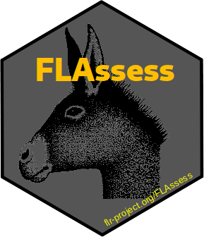

# FLAssess 

[](https://github.com/flr/FLAssess/actions)
[](https://www.gnu.org/licenses/gpl-2.0.html)

## Overview
A generic set of classes for stock assessment models are provided here. Individual assessment packages should extend the basic classes.

## Installation
To install this package, start R and enter:

```
  install.packages("FLAssess", repos="http://flr-project.org/R")
```

or directly from the github repository by using:

```
  remotes::install_github("flr/FLAssess")
```

## License
Copyright (c) 2004-2021 The FLR Team. Released under the [GPL v2](http://www.gnu.org/licenses/gpl-2.0.html).

## Contact
You are welcome to:

- Submit suggestions and bug-reports at: <https://github.com/flr/FLAssess/issues>
- Send a pull request on: <https://github.com/flr/FLAssess/>
- Compose a friendly e-mail to: <flrteam@flr-project.org>
- Author: FLR Team and various [contributors](CONTRIBUTORS.md).
- Maintainer: Iago Mosqueira (WMR) <iago.mosqueira@wur.nl>
